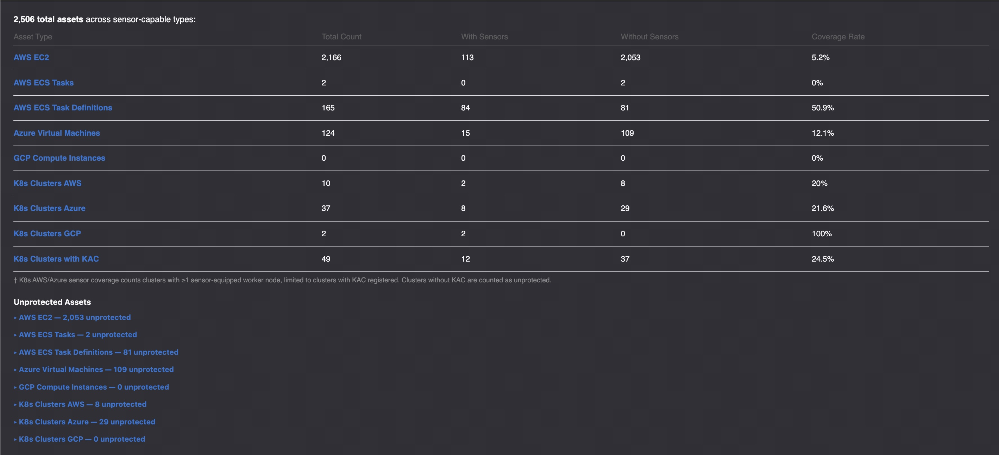

# Falcon Cloud Security — Asset Coverage Dashboard

A CrowdStrike Falcon Foundry app that shows sensor coverage across your cloud environment, broken down by asset type.



## What it does

The dashboard gives you a live view of how many cloud assets have a CrowdStrike sensor deployed versus how many are unprotected. It covers:

| Asset Type | Provider |
|---|---|
| EC2 Instances | AWS |
| ECS Tasks | AWS |
| ECS Task Definitions | AWS |
| Virtual Machines | Azure |
| Compute Instances | GCP |
| Kubernetes Clusters (identified by clusters with container nodes running the Falcon sensor) | AWS EKS · Azure AKS · GCP GKE |

For each type you see: total count, with sensors, without sensors, and coverage percentage.

**Unprotected Assets drilldown** — expand any row to see a list of individual unprotected resources (resource ID, name, cloud account, region, status) so you can prioritize remediation.

Data is pulled live from the Falcon platform APIs on every page load — no manual refresh needed.

---

## Prerequisites

- CrowdStrike Falcon tenant with **Falcon Cloud Security** (CSPM) enabled
- [Foundry CLI](https://developer.crowdstrike.com/foundry/docs/foundry-cli/) installed and authenticated
- Node.js 18+ and npm
- Python 3.9+

---

## Installation

### 1. Clone the repo

```bash
git clone https://github.com/jmckenzie-cs/falcon-cloud-security-focused-asset-coverage-dashboard.git
cd falcon-cloud-security-focused-asset-coverage-dashboard
```

### 2. Create the Foundry app

```bash
foundry apps create --name asset-coverage-dashboard
```

This registers the app in your Falcon tenant and generates a `manifest.yml` containing your unique IDs. **Open that file and note the following four values** — you'll need them in the next step:

| Field | Location in manifest.yml |
|---|---|
| `app_id` | top-level `app_id:` |
| Page ID | `ui.pages.coverage-dashboard.id` |
| Navigation ID | `ui.navigation.id` |
| Function ID | first entry under `functions[].id` |

### 3. Apply the template

Replace the generated manifest with the app's template, then fill in the four IDs you noted above:

```bash
cp manifest.template.yml manifest.yml
```

Open `manifest.yml` in your editor and set the four blank `id: ""` fields to the values from step 2.

### 4. Install UI dependencies

```bash
cd ui/pages/coverage-dashboard
npm install
```

### 5. Build the UI

```bash
npm run build
cd ../../..
```

### 6. Deploy

```bash
foundry apps deploy
```

Select **Patch** as the change type when prompted.

### 7. Release

```bash
foundry apps list-deployments
foundry apps release --change-type patch --deployment-id <id> --notes "Initial release"
```

---

## Required OAuth Scopes

The app requests the following scopes (defined in `manifest.template.yml`):

| Scope | Purpose |
|---|---|
| `cloud-security-assets:read` | Query cloud asset inventory |
| `devices:read` | Detect Kubernetes nodes running the Falcon sensor |
| `kubernetes-protection:read` | Kubernetes cluster metadata |

---

## Project structure

```
.
├── manifest.template.yml          # App manifest template (copy to manifest.yml and fill in IDs)
├── functions/
│   └── asset-coverage/
│       ├── main.py                # Python FDK function (GET /coverage, /details, /debug)
│       └── requirements.txt
└── ui/
    └── pages/
        └── coverage-dashboard/
            └── src/
                └── routes/
                    └── home.jsx   # React UI
```

---

## License

See [LICENSE](ui/pages/coverage-dashboard/LICENSE).
